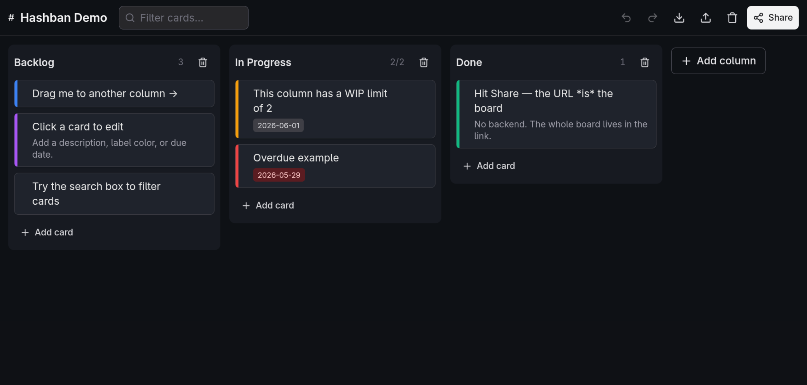

# Hashban — Kanban Board that lives in your URL

**Live demo → [hashban.pages.dev](https://hashban.pages.dev)**



A zero-backend Kanban board encoded entirely in the URL hash. No server, no database, no accounts. **Share the URL = share the board** — the link *is* the data.

## How it works

Every edit serializes the board to JSON, compresses it with [`lz-string`](https://github.com/pieroxy/lz-string), and writes it to `location.hash`:

```
https://hashban.pages.dev/#N4Ig…compressed-state…
```

The hash is the single source of truth. `localStorage` is used only as an offline autosave cache — never authoritative. Nothing ever leaves the browser.

## Features

**Board**
- Editable board title and unlimited columns
- Drag cards anywhere on the card to move/reorder; drag column headers to reorder columns
- **Swimlanes** — horizontal row groupings across all columns (toggle via Layers icon)
- **Board templates** — open `?template=sprint`, `?template=gtd`, or `?template=hiring` to seed a pre-built board
- **Multiple boards** — left-sidebar index backed by IndexedDB; auto-saves 1.5s after each edit; switch boards without losing the current URL

**Cards**
- **Checklist** — subtasks with progress bar on card face
- **Priority** — P1 / P2 / P3 badge (red / orange / yellow)
- **Label color**, **due date** (overdue highlight), **description**
- Full CRUD: add, edit, delete

**Columns**
- **WIP limits** — click the card count badge; badge turns red when exceeded (soft limit)
- **Column color** — tint bar on header, 8-swatch picker
- **Collapse** — fold to slim 40 px vertical bar; click to expand

**Views & navigation**
- **Compact view** — cards collapse to single-line title rows
- **Search / filter** — toolbar search dims non-matching cards instantly; ephemeral, never saved to URL
- **Keyboard nav** — arrows move focus, `Enter` edits, `Delete` removes, `n` adds a card

**Sharing**
- **Share** button — copies URL to clipboard and shows a QR code popover (client-side, no external fetch)
- **QR code** — scan to open on another device
- **RTL support** — Arabic and other RTL text detected automatically via `dir="auto"`

**Persistence & sync**
- **Undo / Redo** (`Ctrl/Cmd+Z` / `Ctrl/Cmd+Shift+Z`) — each step re-commits the hash
- **Import / Export** board as JSON
- Cross-tab and back-button sync via `hashchange`
- Long-URL warning past ~8 000 chars

**Appearance**
- **9 background themes** — 5 solid, 4 gradient (Aurora, Ocean, Cosmos, Ember); saved to `localStorage`
- Demo board on first visit; returning and shared-link users always see their own board

## Keyboard shortcuts

| Key | Action |
|---|---|
| `↑` / `↓` | Move focus between cards |
| `←` / `→` | Jump to adjacent column |
| `Enter` | Edit focused card |
| `Delete` / `Backspace` | Delete focused card |
| `n` | Add card to focused column |
| `Ctrl/Cmd+Z` | Undo |
| `Ctrl/Cmd+Shift+Z` / `Ctrl+Y` | Redo |

## Develop

```bash
npm install
npm run dev      # Vite dev server → http://localhost:5173
npm run test     # Vitest (37 tests)
npm run build    # TypeScript check + Vite bundle → dist/
npm run preview  # Serve production build locally
```

Stack: **React 19 + Vite 6 + TypeScript + Tailwind CSS v4**, drag-and-drop via [`@dnd-kit`](https://dndkit.com/), QR via [`qrcode`](https://github.com/soldair/node-qrcode), board index via IndexedDB. UI primitives hand-rolled (shadcn/ui pattern), no runtime fetch dependencies.

## Deploy

**Cloudflare Pages (recommended):**

1. Connect `uAliAmer/Hashban` in the Cloudflare Pages dashboard.
2. Build command: `npm run build` · Output directory: `dist`
3. Every push to `main` deploys automatically.

**Anywhere else:** `npm run build` emits a static `dist/`. Drop it on GitHub Pages, Netlify, Vercel, S3, or open `dist/index.html` directly — no server required.

**Local CLI:**

```bash
npm run deploy:local   # npm run build + wrangler pages deploy dist
```

## Caveats

- URLs have length limits (~2k–64k chars by browser). Very large boards may exceed them when shared; the app warns past ~8 000 chars.
- Anyone with the URL has full read/write access to the board — treat the link like the data it contains.

## License

[GNU AGPL-3.0-only](./LICENSE)
